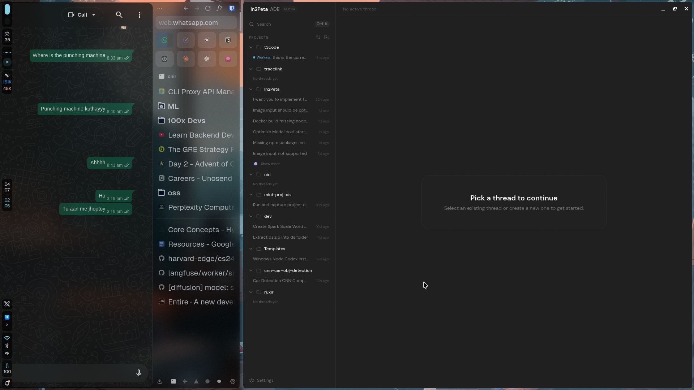
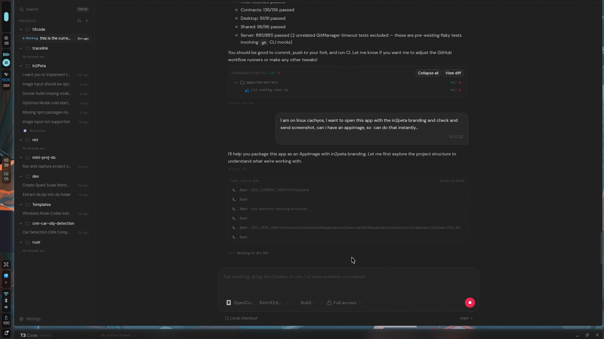

# In2Peta ADE

In2Peta ADE is a minimal web GUI for coding agents (currently Codex and Claude, more coming soon).



## Installation

> [!WARNING]
> In2Peta ADE currently supports Codex, Claude, and OpenCode.
> Install and authenticate at least one provider before use:
>
> - Codex: install [Codex CLI](https://developers.openai.com/codex/cli) and run `codex login`
> - Claude: install [Claude Code](https://claude.com/product/claude-code) and run `claude auth login`
> - OpenCode: install [OpenCode](https://opencode.ai) and run `opencode auth login`

### Run without installing

```bash
npx in2peta-ade
```

### Desktop app

Install the latest version of the desktop app from [GitHub Releases](https://github.com/In2Peta-hub/In2Peta-ADE/releases), or from your favorite package registry:

#### Windows (`winget`)

```bash
winget install In2Peta.In2PetaADE
```

#### macOS (Homebrew)

```bash
brew install --cask in2peta-ade
```

#### Arch Linux (AUR)

```bash
yay -S in2petaade-bin
```

## Screenshots

### Model Picker & New Thread



## Some notes

We are very very early in this project. Expect bugs.

We are not accepting contributions yet.

Observability guide: [docs/observability.md](./docs/observability.md)

## If you REALLY want to contribute still.... read this first

Before local development, prepare the environment and install dependencies:

```bash
# Optional: only needed if you use mise for dev tool management.
mise install
bun install .
```

Read [CONTRIBUTING.md](./CONTRIBUTING.md) before opening an issue or PR.

Need support? Join the [Discord](https://discord.gg/jn4EGJjrvv).
